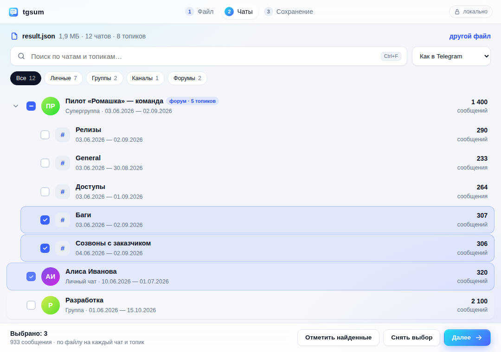
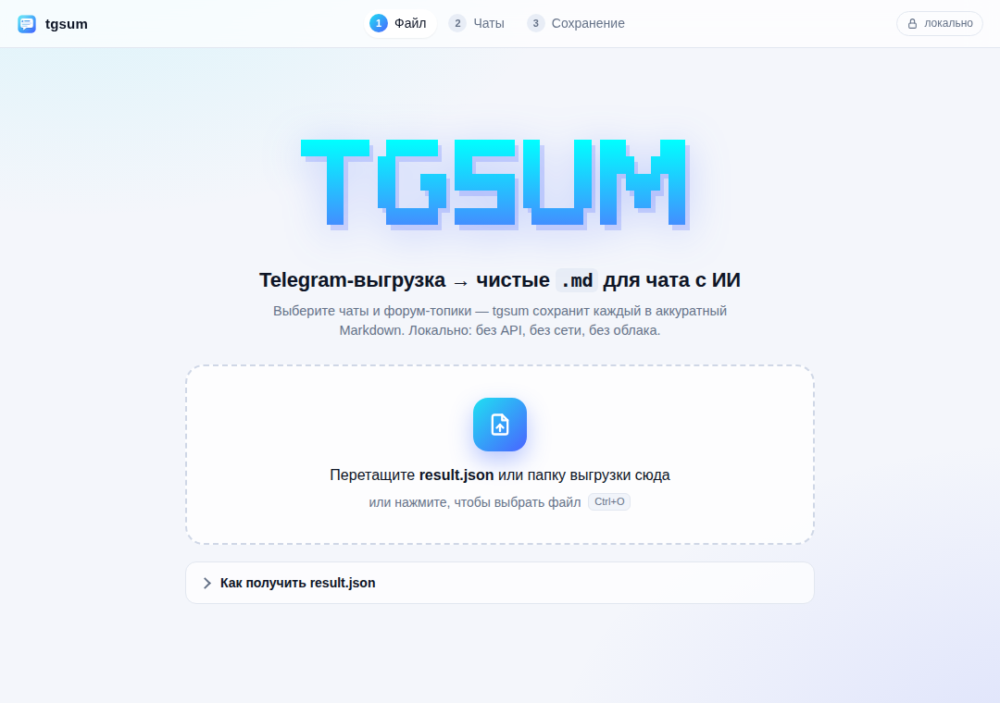

<div align="center">

```
████████╗ ██████╗ ███████╗██╗   ██╗███╗   ███╗
╚══██╔══╝██╔════╝ ██╔════╝██║   ██║████╗ ████║
   ██║   ██║  ███╗███████╗██║   ██║██╔████╔██║
   ██║   ██║   ██║╚════██║██║   ██║██║╚██╔╝██║
   ██║   ╚██████╔╝███████║╚██████╔╝██║ ╚═╝ ██║
   ╚═╝    ╚═════╝ ╚══════╝ ╚═════╝ ╚═╝     ╚═╝
```

**Telegram-выгрузка → чистые `.md` файлы под чат с ИИ.**
Десктоп-приложение для macOS, Windows и Linux. Локально: без API, без сети, без облака.

[](https://github.com/Roflochinsky/tgsum/releases)




</div>

---

## Что это

`tgsum` берёт экспорт Telegram Desktop (огромный `result.json`, до пары ГБ) и даёт выбрать нужные
чаты и форум-топики. Каждый из них сохраняется в аккуратный, экономный по токенам Markdown,
который можно вставить в чат с Claude или ChatGPT и попросить саммари.

Сам инструмент **ничего не суммаризирует и никуда не отправляет**: он только вытаскивает
и причёсывает данные. Анализ делает ИИ-чат на твоей стороне.

## Возможности

- 🖱 **Перетащил, выбрал, сохранил.** Три шага, без терминала и флагов.
- 🔎 **Поиск по чатам и топикам**, фильтры (личные, группы, каналы, форумы), сортировка, мультивыбор.
- ⚡ **Быстро и без обжорства.** Движок на Rust читает `result.json` потоком: выгрузка в 1 ГБ индексируется
  примерно за 4 секунды и занимает около 16 МБ памяти.
- 🧵 **Форум-топики.** Супергруппы раскладываются по топикам (General и остальные).
- ✂️ **Автонарезка на части** под лимит контекста (30k–150k токенов или без нарезки) **без потерь**:
  у каждой части своя шапка.
- 🧹 **Чистый формат.** Спикеры, реплаи, даты; служебные сообщения и реакции вырезаны.
- 🌗 **Светлая и тёмная тема** следуют системным настройкам.
- 🔒 **Полностью локально.** Ни сети, ни ключей, ни телеметрии.

## Установка

Скачай установщик для своей системы со страницы [**Releases**](https://github.com/Roflochinsky/tgsum/releases):

| Система | Файл |
|---|---|
| macOS (Apple Silicon: M1…M4) | `tgsum_…_aarch64.dmg` |
| macOS (Intel) | `tgsum_…_x64.dmg` |
| Windows 10/11 | `tgsum_…_x64-setup.exe` (или `.msi`) |
| Linux | `.AppImage`, `.deb` или `.rpm` |

> До v0.2 tgsum был консольным мастером на Node и ставился через npm (`@roflochinsky/tgsum`).
> Теперь это отдельное приложение, Node не нужен; npm-пакет больше не обновляется.

> **Первый запуск.** Сборки пока не подписаны сертификатом разработчика, поэтому система переспросит:
> - **macOS:** открой приложение через правый клик → **Открыть**. Если не помогло:
>   **Системные настройки → Конфиденциальность и безопасность → «Всё равно открыть»**.
> - **Windows:** в окне SmartScreen нажми **Подробнее → Выполнить в любом случае**.

## Как пользоваться



1. **Файл.** Перетащи `result.json` (или всю папку выгрузки) в окно. Можно и кнопкой.
2. **Чаты.** Найди и отметь нужные чаты и топики.
3. **Сохранение.** Выбери папку и размер файла, нажми «Сохранить», потом «Открыть папку».

Готовые `.md` вставляй в чат с ИИ.

<br clear="right">

### Как получить result.json

Telegram Desktop → ⚙ **Настройки** → **Продвинутые настройки** → **Экспорт данных из Telegram**
(*Export Telegram data*) → формат **Машиночитаемый JSON** (медиа можно не включать) → **Экспортировать**.
В папке экспорта появится `result.json`.

## Пример вывода

```markdown
# Чат: Команда / Топик: Релизы
# Период: 2026-06-18 — 2026-06-20 | сообщений: 142 | участники: Алиса, Боб, Вера

## 2026-06-20
[14:02] Алиса: когда катим релиз?
[14:03] Боб: давай в 15:00, сначала смёржь PR #210
[14:05] Вера ↳ Боб «смёржь PR #210»: смёржила
[14:06] Боб: [photo] логи деплоя
[14:40] Алиса: [voice 0:42]
```

## Что сохраняется, а что нет

| Сохраняется | Вырезается / сворачивается |
|---|---|
| Текст сообщений, имена авторов | Служебные сообщения (вошёл/закрепил/звонок) |
| Реплаи (`↳ Имя «цитата»`) | Реакции |
| Даты и время | Стикеры → `[sticker 👍]` |
| Ссылки, упоминания, подписи к фото | Фото/видео/голос → `[photo]` / `[voice 0:42]` / `[file: …]` |

> Голосовые и медиа сворачиваются в маркеры, потому что в выгрузке Telegram **нет
> расшифровок**, только файлы. Подписи к медиа (текст) сохраняются.

## Как это работает

Два потоковых прохода по `result.json`. Первый строит лёгкий индекс (чаты, топики, счётчики, даты)
и держит в памяти только один чат за раз, без текстов сообщений. Второй вытаскивает выбранное
и останавливается, как только нашёл всё нужное. Большой чат режется на `имя.part-1.md`,
`part-2.md`… **без потери сообщений**: каждая часть несёт ту же шапку, ни одно сообщение не выпадает.

```
core/        tgsum-core — Rust-библиотека: потоковый парсер, топики, Markdown, запись файлов
src-tauri/   приложение на Tauri 2: окно, команды, диалоги, прогресс и отмена
ui/          интерфейс: HTML + CSS + JS без сборки и без npm
```

## Сборка из исходников

Нужен [Rust](https://rustup.rs) ≥ 1.85, а на Linux ещё системные библиотеки WebKitGTK:

```bash
# Debian/Ubuntu
sudo apt install libwebkit2gtk-4.1-dev libgtk-3-dev librsvg2-dev libxdo-dev libssl-dev
```

```bash
cargo run -p tgsum                    # запустить приложение
cargo test --workspace                # тесты (ядро + команды приложения)

cargo install tauri-cli --version "^2" --locked
cargo tauri build                     # установщики → target/release/bundle/
```

Релизы собирает GitHub Actions: пуш тега `v*` публикует черновик релиза с установщиками
для всех платформ (`.github/workflows/release.yml`).

## Лицензия

MIT
