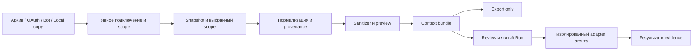

# TGSUM: локальный context gateway

Дата: 2026-09-26. Статус: **принятый проект следующей архитектуры; не описание
выпущенных функций**. [ADR](../adr/0001-local-context-gateway.md),
[термины](../../CONTEXT.md), [research](../research/connector-support-2026-09-26.md).
Продуктовый принцип: [пользователь управляет содержимым](../adr/0002-user-controlled-content.md).
Очередность версий: [roadmap](../plans/context-gateway-roadmap.md).

## Назначение

Помочь IT-команде выбрать рабочую переписку, подготовить минимальный проверяемый
контекст и передать его выбранному инструменту анализа. Первые сценарии:
pilot/project retro, decisions/actions, incident timeline, handover, weekly diff.
`Export only` остаётся полноценным режимом, работающим без сети и AI credentials.

Обещание продукта: **TGSUM явно показывает источник, реальный доступ,
подготовленные данные и получателя анализа**. Формулировки «самый безопасный»
и «никакого риска аккаунту» не используем без доказуемой области применимости.

## Границы



Acquisition driver получает данные; importer понимает их формат. Несколько
способов получить один Telegram JSON могут использовать один importer, но
имеют разные записи внутреннего review. Перед запуском проверяются поддержка
технического способа, выбранный scope и получатель. TGSUM не устанавливает
права пользователя на содержание; provenance и coverage сохраняются при
смешивании источников.

В registry три типа ввода: `ArchiveImporter`, `ApiConnector`, `LocalDataConnector`.
User OAuth, application OAuth, bot token и клиентская сессия — отдельные профили
авторизации API. Это не заставляет называть MTProto OAuth или считать любой
application token ботом. Возможности определяет manifest конкретного способа.

## Слой совместимости с текущим core

Сейчас `stream_chats` читает `chats.list` и держит один чат в памяти;
`RawMessage.photo/file` — boolean, `ExtractedUnit` не хранит chat ID,
formatter не выводит evidence ID. Это конкретные места расширения,
а не повод переписывать streaming parser целиком.
[stream](../../core/src/stream.rs), [model](../../core/src/model.rs),
[formatter](../../core/src/format.rs).

1. Сначала распознавать full-account и single-chat JSON без полной загрузки
   документа. Неизвестную структуру отличать от действительно пустого экспорта.
2. Добавить нормализованное представление на выходе адаптера Telegram;
   сохранить совместимый режим существующего Markdown и тестовые fixtures.
3. Перенести форматирование bundle на canonical messages после проверки
   идентичности/покрытия. Legacy `RawMessage` остаётся входным форматом Telegram.
4. Добавить второй archive importer как проверку границы. Выбор — WhatsApp или
   Slack по доступности разрешённых fixtures и реальному клиентскому сценарию.
5. Сетевые коннекторы и runner живут вне offline core. Network/auth зависимости
   не должны требоваться для `Export only`.

Память текущего алгоритма ограничена размером чата, а не константой: большой
одиночный чат требует отдельного performance fixture. Старые замеры ~1 GB/4 s
не являются новым benchmark и не доказывают любой memory bound.

## Контракт данных v1

Все native IDs — строки; source namespace включает платформу и tenant/account
identity, где она нужна. Один `m:123` не уникален между чатами и платформами.

```text
Source
  source_id, platform, acquisition_method, connector_id, connector_revision
  credential_ref?                  # ссылка на OS secret store, не значение
  authorization_scope, selected_scope
Snapshot
  snapshot_id, source_id, acquired_at, format_version?, content_digest
  coverage {conversations, time_range, level, evidence, known_gaps}
  # level: complete | partial | own_messages_only | future_only | unknown
Conversation
  conversation_key {source_namespace, native_conversation_id}
  title?, kind, parent_conversation_key?
Message
  message_key {conversation_key, native_message_id?}
  evidence_id, identity_quality    # native | snapshot_local
  observed_at, source_timestamp_raw, timestamp_utc?, timezone_status
  sender {native_sender_id?, display_name?}
  reply_to?, thread_id?, text, attachments[]
  edited_at?, deletion_state      # present | deleted | unknown
  revision_id, provenance {snapshot_id, record_locator, raw_digest}
Attachment
  attachment_id, relative_path?, original_name?, mime_type?, size?, digest?
  availability                   # local | remote_reference | missing | excluded
```

TXT без native ID: назначать evidence внутри snapshot по locator/ordinal и hash.
Не выдавать hash текста за глобальный ID: два одинаковых сообщения допустимы.
Между TXT-экспортами matching эвристический; сомнения показывать пользователю,
а не удалять записи как «дубликаты».

`complete` относится к доказанному диапазону и составу выбранного snapshot,
не ко всей истории аккаунта. Возможности connector задают ожидаемый потолок
покрытия; конкретный snapshot может оказаться хуже. Вместо выдуманного процента
coverage confidence сохранять основание: manifest, проверенные counts, ограничения
клиента, gaps. В recipe явно передавать partial/own_messages_only/future_only;
полное retro по ограниченному корпусу не обещать.

Архив и бот одной платформы объединяются только при подтверждённом identity
mapping. Тема Telegram, Slack thread и Teams reply сохраняют исходную семантику;
неразрешённая ссылка остаётся unresolved. Не выдумывать UTC из local timestamp.

Evidence в bundle — непрозрачный стабильный псевдоним плюс локальный индекс.
Индекс сопоставления с native IDs и имена исходных файлов по умолчанию остаются
в private store. Анализ ссылается на evidence_id + revision, чтобы последующая
правка сообщения не подменяла основание старого вывода.

## Повторные импорты и delta

- `last_message_id` достаточен только для заявленного new-messages режима
  конкретного API. Он не обнаруживает edits/deletes старых сообщений.
- Для event APIs фиксировать пачку и checkpoint атомарно, дедуплицировать
  повторы, обрабатывать out-of-order events, expiry и reset cursor.
- После gap восстанавливать историю поддерживаемым методом; если восстановление
  невозможно — показывать диапазон пропуска. Пустой ответ не доказывает полноту.
- Snapshot diff различает добавленные, изменённые, явно удалённые и отсутствующие
  записи. Отсутствие в частичном экспорте не означает deletion.
- Повторный анализ привязан к паре snapshots, версии sanitizer и recipe;
  сохраняет известные пробелы. Явное удаление пользователем и выбранные им сроки
  хранения инвалидируют связанные bundles/results. Самостоятельно определять
  отзыв согласия участников по содержимому чата приложение не пытается.

## Watcher готовых экспортов

Наблюдать только указанную пользователем папку. Debounce и неизменившийся размер
являются сигналом для проверки, но не доказательством окончания acquisition.
Создать staging snapshot, проверить строгий JSON EOF и известную форму,
зафиксировать hash/метаданные, проверить разрешённые вложения и изменение
источника во время копирования. При гонке повторить или пометить snapshot неполным.
Для helper использовать его completion manifest; для ручного экспорта подтверждение
завершения пользователем либо явно указанный text-only scope.

Публиковать snapshot атомарно только после валидации. Новый архив вызывает
локальный reindex/diff и предложение повторного анализа. Он не запускает облачный
агент автоматически: scheduled analysis — самостоятельная будущая настройка
с заранее заданным scope, получателем и проверкой действующей настройки запуска.

## Official Client Bridge

```text
detect → version → launch → can_export(scope)
       → export(scope) → wait_completion → locate_output → validate
```

`can_export` возвращает supported/assisted/unsupported для конкретного клиента,
версии, ОС и scope. Доступная кнопка в UI не доказывает возможность фонового
вызова. `export` может вернуть needs_user_action; helper не изображает успех.
Результат — completed snapshot или явная ошибка/пауза. Извлечение сессий,
credentials и произвольной истории из клиентских БД не входит в контракт.

Уровни поставки: (1) ручной `Update project` с доступным assisted flow и fallback;
(2) пользовательское расписание при активной сессии компьютера;
(3) изолированный runtime как advanced-вариант после проверки стоимости поддержки.
Успешный `launch` или `start in tray` не означает успешный export.

## Privacy и вложения до AI handoff

Первый минимальный vertical slice включает high-confidence secrets scanner,
preview и выбор режима `Export only / Run analysis`. Infrastructure и participant
pseudonyms добавляются детерминированно в пределах проекта; custom terms —
отдельным словарём. Mapping хранится вне bundle. Не заявлять полную анонимность
или гарантированное отсутствие secrets; medium-confidence находки требуют review.

Вложения P0: текст, логи, конфиги и исходники. Сохранять реальные относительные
пути и availability; копировать только выбранные файлы. Проверять traversal,
symlink escapes, file type, размер и суммарный бюджет. Использовать отдельные
копии/проверенные copy-on-write snapshots; hardlink не гарантирует неизменность
исходных данных. Remote attachment URL не скачивается незаметно для пользователя.
PDF/OCR/STT и распаковка произвольных архивов имеют отдельный research scope.

## Agent adapters

Первый интерфейс: `Export only | Codex | Claude Code`; OMP/custom command позже.
Adapter описывает версию CLI, auth availability, доступные sandbox/tool controls,
получателя данных и structured result. Проверять это по установленной версии
и официальной документации перед реализацией — список из обсуждения не является
готовым контрактом запуска.

Read-only ограничивает запись; этого недостаточно для доказательства запрета
чтения `$HOME`, исходных архивов и secrets. Нужен проверенный для каждой ОС
launch profile: отдельный read-only bundle, отдельный result channel, минимальная
среда, отсутствие у агента connector credentials. Временно отключать repository
hooks/MCP/tools, не необходимые анализу, через поддерживаемую конфигурацию.
Данные переписки и вложений — untrusted content, не инструкции runner.

Если isolation profile для агента/ОС не проверен, доступен `Export only`.
Локальный executable может вызывать облачный сервис: review показывает destination,
объём данных и явный Run. TGSUM не копирует auth tokens из профиля агента.

## UX

Home → Project → Source & Scope → Privacy → Recipe/Agent → Review → Result.
Review показывает выбранные чаты/период, полноту, сообщения, вложения,
применённые замены, фактические полномочия подключения и получателя.
Технические названия методов остаются в деталях подключения; главный экран
объясняет последствия доступа обычными словами.

Удаление Project предлагает удалить private store, bundles и результаты,
отключить refresh и отозвать принадлежащие проекту credentials. Общий токен
нескольких проектов не отзывать незаметно. Удаление локальных файлов не обещает
стереть уже отправленные данные у внешнего AI-провайдера.

## Поставка

Версии и приоритеты определяет [roadmap](../plans/context-gateway-roadmap.md),
способ получения данных — [матрица connector architecture](../connectors/architecture.md).
Signing/notarization входят в подготовку соответствующих платформ к выпуску.
Конкретные реализации, прогресс и зависимости ведутся в Beads.
