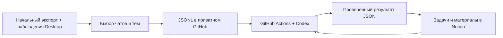

# Telegram → GitHub → Codex → Notion

Дата: 2026-10-08. Beads: `tgsum-0e1`. Статус: **предложение нового потока**.
Пользователь запросил облачную смысловую обработку вместо обработки на компьютере
и выбрал новую личную страницу Notion. Это документ для согласования объёма;
он не означает, что structured publisher, Actions или автоматический sync уже работают.

## Что меняется

На компьютере остаются получение сообщений, выбор чатов/тем, проверка формата,
устойчивое хранение и доставка. Саммари, выделение задач, планирование, подготовка
к встречам и ретро выполняются в GitHub Actions с Codex. Notion служит рабочей
доской и местом для отчётов. Анализ не требует, чтобы окно TGSUM оставалось открытым;
новое получение из Desktop требует работающего компьютера и Telegram.



Обратная связь из Notion даёт обработчику текущие статусы, ответственных
и плановые даты для анализа и предложений. Ручные поля после создания карточки
обработчик не перезаписывает. Это не обратная отправка сообщений в Telegram.

## Текущее поведение

- Пакет из обычного JSON экспорта содержит `context-*.md`, manifest и выбранные
  вложения. Его publisher обновляет `packages/<project-id>` обычным Git-коммитом;
  повтор неизменённого пакета не создаёт коммит. Raw `result.json` не публикуется.
- Источник диагностических наблюдений дополняет сохранённую историю, но его
  пакет помечен `local_only`; desktop и publisher запрещают его отправку.
- В настроенном приватном репозитории есть прежняя публикация, но текущая
  локальная выгрузка новее неё. Отсутствуют обычные secrets `OPENAI_API_KEY`,
  `NOTION_TOKEN`, `NOTION_API_KEY` и workflow в проверенном пути `.github/workflows`
  (метаданные проверены, значения секретов не читались).
- Личный каркас Notion создан в этом срезе. Это не подтверждение доступа будущего
  GitHub runner к странице: подключение Notion в этом чате не передаётся в Actions.

Код: [publisher](../../src-tauri/src/package_github.rs),
[ограничение local-only](../../core/src/local_package/mod.rs),
[постоянный локальный источник](telegram-continuous-source.md).
Принятые [ADR-0001](../adr/0001-local-context-gateway.md) и
[ADR-0002](../adr/0002-user-controlled-content.md) остаются действующими для старого
локального потока. Новый автоматический cloud run требует отдельного заранее
сохранённого scope и получателя; этот proposal не снимает старые runtime gates.

## Структурированный вход

Предлагается JSONL: одно нормализованное сообщение на строку, по отдельному
стабильному пути каждого выбранного чата. Начальный экспорт даёт историю;
новые наблюдения обновляют те же записи по точному ключу. Импорт другого чата
не меняет namespace уже существующего. Названия используются как подписи.

```text
input/<conversation-key>/messages.jsonl
input/<conversation-key>/coverage.json
input/selection.json
results/tasks.json
results/reports/<report-key>.md
state/processed.json
state/notion-sync.json
```

Запись включает строковые ID источника, чата, сообщения, темы и автора; текст,
исходное время, время правки, reply target, ссылки на вложения, версию сообщения
и provenance. Неизвестный топик остаётся неизвестным. Полный raw debug log,
чужие чаты, account credentials и локальные служебные файлы не отправляются.
Доступные имена автора и тема не выдумываются. Вложения начального экспорта
и новые медиа различаются: получение новых медиа через логи пока не реализовано.

JSONL не означает отмену сохранённых правил приватности. До включения доставки
фиксируется outbound schema: разрешённые поля, стабильные внешние псевдонимы
и правила сокрытия выбранных значений. Точные native keys остаются в локальном
источнике; внешний corpus не требует раскрывать private mapping. Уже выбранное
сокрытие не выключается автоматически ради нового формата. Это техническая
подготовка передачи; вся смысловая обработка остаётся в GitHub. Конкретные поля
нового внешнего контракта ещё требуют согласования перед реализацией publisher.

Отсутствие сообщения в новом частичном экспорте не обозначает удаление. Явное
наблюдаемое удаление хранится отдельным состоянием. Coverage/gaps передаются
вместе с сообщениями и входят в результат анализа. Версии и основания в Git
позволяют ссылаться на конкретный commit, сообщение и его revision.

Публикуется актуальное выбранное состояние; GitHub показывает diff обычного
коммита. Обработчик сравнивает ключи и версии, а не интерпретирует строки
текстового Git diff как самостоятельные сообщения. При объединении обновлений
он проверяет весь диапазон от последнего успешного input commit до закреплённого
нового commit, включая промежуточные правки и явные удаления; только последний
push event не является надёжным курсором.

## Облачная обработка

1. Изменение `input/**` или явный ручной запуск выбирает закреплённый input SHA.
   Частота пакетной обработки, модель и бюджет ещё не настроены. Плановые отчёты
   используют ту же реализацию с явно заданным периодом, зоной `Europe/Moscow`
   и целью; «созвон в среду» пока является сценарием, не созданным расписанием.
2. Обработчик читает изменения после успешного checkpoint, относящийся к ним
   контекст обсуждения и существующие задачи. Для ретро требуется весь выбранный
   доступный период, а не только последнее изменение файла.
3. Codex возвращает JSON по schema: кандидатные задачи, решения, вопросы,
   feedback и отчёты с evidence. Сообщения передаются как данные; они не могут
   менять инструкцию обработчика, выдавать себе инструменты или секреты.
4. Детерминированная проверка проверяет schema, принадлежность evidence выбранному
   набору и его revision. Согласованный дедлайн требует основания; предлагаемая
   плановая дата хранится отдельно. Семантическую истинность schema не доказывает.
5. Проверенный результат фиксируется в `results/**`. Sync отдельно создаёт или
   обновляет Notion по стабильным ключам. Успешный analysis checkpoint и успешный
   Notion checkpoint различаются: сбой Notion не вызывает повторный AI inference.

Новые задачи по умолчанию попадают во «Входящие». Не каждое предложение
становится поручением. При повторном анализе существующий task key сохраняется;
текст заголовка не является ключом. Неоднозначное объединение отмечается для
разбора. После создания карточки sync никогда не пишет человеческие статус,
ответственного, плановую дату и дедлайн. Изменения, предлагаемые AI, сохраняются
в отдельных полях или блоках, принадлежащих автоматизации; пользователь принимает
их сам. Эти поля ещё не добавлены в созданный каркас. Read-before-PATCH не является
защитой от одновременной ручной правки: у проверенного Notion endpoint нет
документированного compare-and-swap. Статус «Готово» не сбрасывается новой сводкой,
отсутствие задачи в выводе модели не удаляет карточку.

Последовательная обработка проекта, retry, фиксация результата до side effects
и lookup по ключу нужны для повторов без дубликатов. До create в устойчивом
outbox фиксируется намерение с task key. Потерянный ответ или timeout сохраняют
состояние «исход создания неизвестен». Повторный lookup может найти карточку,
но пустой ответ сам по себе не доказывает, что создание не завершилось, и не
разрешает новый POST. Неопределённая операция остаётся на reconciliation:
повторные чтения с паузами, затем ручной разбор, если результат не установлен.
Новая попытка create допускается только после подтверждённого отсутствия
создания; автоматический retry по одному lookup miss запрещён. Concurrency
и отмена job не заменяют checkpoint. Результаты и служебные коммиты не запускают
input workflow снова.
Только проверенный sync получает Notion credential; inference job его не получает.

## Рабочие сценарии

| Сценарий | Результат |
| --- | --- |
| Задачи и план дня/недели/месяца | Карточки, статус, проект, известный ответственный, предложенная плановая дата и отдельный подтверждённый дедлайн |
| Подготовка к созвону | Повестка, принятые решения, открытые вопросы и блокеры со ссылками на задачи/сообщения |
| Обратная связь о продукте | Группы проблем и запросов, основания, повторяющиеся сигналы и кандидаты в действия |
| Ретро за две недели | Результаты, затруднения и предложения по конкретному доступному периоду |

## Созданная основа Notion

Новая личная страница содержит пустую inline-базу «Задачи» и три страницы-шаблона:
подготовку к созвону, обратную связь о продукте и ретро за две недели.
В базе: название, статус, проект, ответственный, плановая дата, дедлайн,
приоритет, основание, источник и ключ синхронизации.
Kanban группирует по «Входящие / Запланировано / В работе / Готово».
Пустые группы скрываются текущим представлением Notion; карточки появятся после
добавления задач. Рабочих или демонстрационных задач не добавлено.

Представления текущих периодов используют сохранённые фильтры дат:
8 октября 2026; 5–11 октября 2026; 1–31 октября 2026. Это закреплённые диапазоны,
не автоматический rollover. Инструмент не сохранил фильтры по formula properties;
это обнаружено readback и заменено явными date filters, не оставлено как успех.
Бесполезные созданные formula properties удалены до появления любых строк.
Будущий cloud sync должен обновлять границы периодов или использовать отдельно
проверенный native relative-date механизм. Личные ссылки/IDs хранятся вне git.

## Первичные источники и границы проверки

Прочитаны 2026-10-08:

- [Codex GitHub Action](https://learn.chatgpt.com/docs/github-action): Action
  запускает `codex exec`, поддерживает schema output; документированный вариант
  использует API key из GitHub secret. Новый реальный inference не запускался.
- [GitHub workflow events](https://docs.github.com/en/actions/reference/workflows-and-actions/events-that-trigger-workflows):
  доступны push и другие triggers. Некоторые действия с `GITHUB_TOKEN` не запускают
  следующий workflow; способ фиксации input и запуск не следует смешивать.
- [Notion update page](https://developers.notion.com/reference/patch-page): можно
  обновлять свойства страниц по схеме источника; неуказанные свойства сохраняются.
  Реальный API-token grant runner ещё не выдан и не проверен.
- Notion MCP `enhanced-markdown-spec` и `view-dsl-spec` прочитаны через connector;
  создание страницы/базы/view доступно, конфигурация прочитана обратно.

Перед кодом нового cloud handoff нужен [connector review](../connectors/review-policy.md)
для структурированного формата/AI-получателя/Notion API, credentials с минимальными
полномочиями и решение о включении. Registry здесь не повышается до supported.
Секреты задаются в GitHub Secrets, а не в чате или репозитории. API inference может
иметь отдельную стоимость; ни расходы, ни новые cloud jobs этим срезом не запущены.

## Что будет доказательством полной реализации

Реальное новое выбранное сообщение → точная структурированная запись в GitHub →
проверенный cloud result → одна Notion-карточка с evidence. Повтор не создаёт
дубликаты; правка сообщения обновляет результат; ручной статус сохраняется;
ошибка сети/схемы не подтверждает соответствующий checkpoint и сохраняет прежний
результат; успешный analysis checkpoint не отменяется из-за сбоя Notion sync.
Фильтры выбранных топиков не расширяются, временные периоды обновляются правильно,
известные gaps видны. Негативные/mutation tests должны ловить нарушения.
До этой проверки текущая цепочка не заявляется готовой.

Откат автоматизации: остановить cloud triggers и publisher, сохранив источники,
commits и Notion-данные. Удаление истории, карточек или исходного экспорта не входит
в откат и требует отдельного запроса пользователя.
